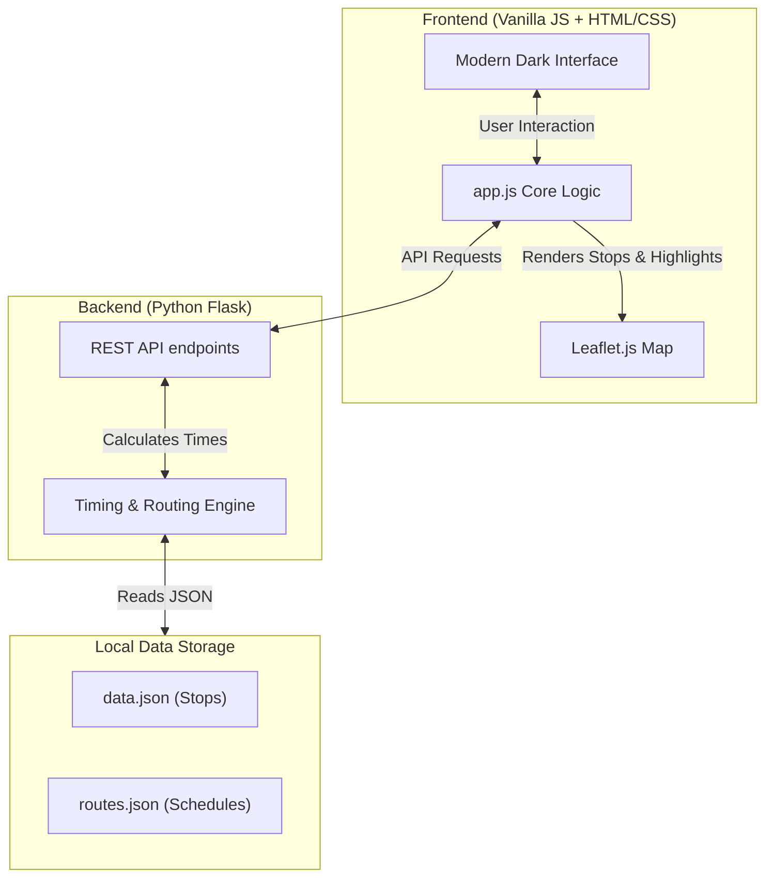
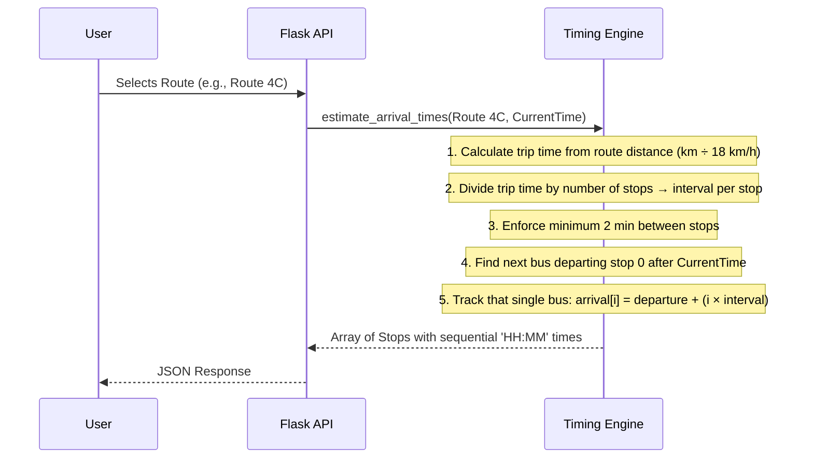

# CTU Bus Route Visualizer Architecture & Implementation

This document provides an in-depth, architectural overview and function-by-function explanation of the CTU Bus Route Visualizer. 

## System Architecture

---

## 1. Data Layer

The application operates without a traditional database, relying instead on static JSON files loaded into memory for extreme speed, low latency, and simple deployment.

- **`data.json`**: Contains raw coordinate data (latitude, longitude) and metadata for 888 bus stations across the city.
- **`routes.json`**: Contains the logical definition of the 52 routes. Each route defines its sequential stops, its timetable (e.g., `06:10-18:40`), frequency, total buses assigned, and a visual hex color for map rendering.

---

## 2. Backend (`backend/app.py`)

The backend is built on Flask and acts as the data processing and routing engine.

### Core Mathematical Algorithm (`estimate_arrival_times`)

The backend dynamically computes when a bus will arrive at a given stop by tracking a **single physical bus** through all its stops, ensuring times always increase sequentially.

- **Trip Time from Distance:** Uses the route's `length_km` from `routes.json` and calculates total one-way trip time at a realistic city bus speed of **18 km/h**. Falls back to `frequency × num_buses` estimation if distance is unavailable.
- **Stop Intervals:** Divides total trip time evenly across all stops. Enforces a **minimum of 2 minutes** between stops to prevent unrealistic sub-minute intervals on routes with many stops.
- **Single Bus Tracking:** Finds ONE next bus departure from stop 0, then calculates every subsequent stop's arrival by adding cumulative elapsed time. This guarantees times are **always monotonically increasing** (e.g., 18:00 → 18:04 → 18:08 → 18:12), preventing the previous bug where different stops could match to different physical buses.

### API Endpoints
- **`/api/routes`**: Returns a lightweight summary list of all routes to populate the search panel.
- **`/api/routes/<route_id>`**: Fetches full route data, running it through the timing engine to inject real-time estimates before returning it.
- **`/api/suggest`**: Autocomplete engine using strict substring matching to return the closest stop name suggestions as the user types.
- **`/api/plan`**: Trip Planner engine. It scans all routes to find ones containing the user's `from` stop and `to` stop in the correct travel order. It calculates total travel time and returns the top 5 fastest upcoming bus routes.

---

## 3. Frontend (`frontend/app.js`)

The Vanilla JS frontend connects the user interface to the Flask backend and handles the Leaflet rendering engine.

### Application Flow & Map Rendering

```mermaid
flowchart LR
    A[User Opens App] --> B[Leaflet Map Initializes]
    B --> C{User Action}
    
    C -->|Trip Planner| D[Enter From/To]
    D --> E[Autocomplete Dropdowns]
    E --> F[API /plan Request]
    F --> G[Render Plan Cards]
    G --> H[Click Card to View Route]
    
    C -->|Browse Routes| I[Open Right Panel]
    I --> J[Filter/Search Routes]
    J --> K[Click Specific Route]
    
    K --> L[API /routes Request]
    H --> L
    L --> M[Clear Old Map Markers]
    M --> N[Draw CircleMarkers at Stops]
    N --> O[Highlight Specific Search Stops]
```

- **`initMap()`**: Initializes the open-source Leaflet map using OpenStreetMap tiles. We migrated away from Google Maps to prioritize a cleaner, stop-centric interface without restrictive API keys.
- **`showRouteOnMap()`**: Iterates through the route's stops to drop circular markers (`L.circleMarker`). Route lines are intentionally hidden to keep the map minimalist and uncluttered. It highlights the specific origin and destination stops in bright orange if they were searched via the Trip Planner.
- **`setupAutocomplete()`**: Attaches input listeners to provide real-time stop filtering and dropdowns to eliminate user typos when searching for current locations and destinations.

