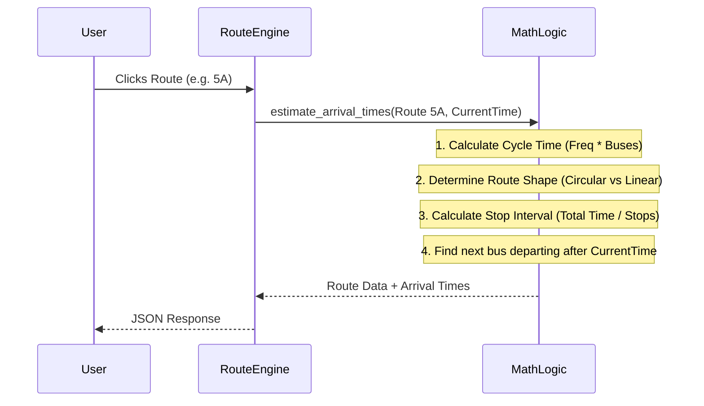

# CTU Bus Route Visualizer Architecture & Implementation

This document provides an in-depth, architectural overview and function-by-function explanation of the CTU Bus Route Visualizer. 

## System Architecture

```mermaid
graph TD
    subgraph Frontend [Frontend (Vanilla JS + HTML/CSS)]
        UI[User Interface]
        Maps[Google Maps API]
        Logic[app.js Core Logic]
    end

    subgraph Backend [Backend (Python Flask)]
        API[REST API endpoints]
        Math[Timing & Routing Engine]
    end

    subgraph Data [Local Data Storage]
        ST[stations.json / data.json]
        RT[routes.json]
    end

    UI <--> |User Interaction| Logic
    Logic <--> |API Requests| API
    Logic --> |Renders Routes & Markers| Maps
    API <--> |Calculates Times| Math
    Math <--> |Reads JSON| Data
```

## 1. Data Layer

The application operates without a database, relying on static JSON files loaded into memory for extreme speed and simple deployment.

- **`data.json`**: Contains raw coordinate data (latitude, longitude) and metadata for 888 bus stations across the city.
- **`routes.json`**: Contains the logical definition of the 52 routes. Each route defines its sequential stops, its timetable (e.g., `06:10-18:40`), frequency, total buses assigned, and a visual hex color for map rendering.

## 2. Backend (`backend/app.py`)

The backend is built on Flask and acts as the data processing engine.

### Core Mathematical Algorithm (`estimate_arrival_times`)

The backend dynamically computes when a bus will arrive at a given stop without needing a hardcoded per-trip schedule.



- **Cycle Time:** It multiplies the route's `frequency` by `num_buses` to figure out the total cycle time.
- **One-Way Factor:** Checks if a route is circular (starts and ends at the exact same stop). If circular, traversing takes 90% of the cycle time. If linear, it takes 45%.
- **Stop Intervals:** Divides that total travel time evenly across the number of stops to find the driving time between adjacent stops.
- **Next Bus Calculation:** Iterates through the daily schedule for that stop and mathematically finds the first bus arriving *after* the user's current time.

### API Endpoints
- **`/api/routes`**: Returns a lightweight summary list of all routes to populate the sidebar.
- **`/api/routes/<route_id>`**: Fetches full route data, running it through the timing engine to inject real-time estimates before returning it.
- **`/api/suggest`**: Autocomplete engine using custom fuzzy matching logic (`fuzzy_match()`) to return the closest 15 stops based on user input.
- **`/api/plan`**: Trip Planner engine. It scans all routes to find ones containing the `from` stop and `to` stop in the correct travel order. It calculates total travel time and returns the top 5 fastest routes based on wait time.

## 3. Frontend (`frontend/app.js`)

The Vanilla JS frontend connects the user interface to the Flask backend and handles the complex Google Maps rendering engine.

### Map Rendering Pipeline

```mermaid
flowchart LR
    A[User Selects Route] --> B[Fetch Route Data from API]
    B --> C[Clear Previous Map Layers]
    C --> D[Draw Stop Markers]
    D --> E[Batch Waypoints into groups of 23]
    E --> F[Call Google Maps Directions API]
    F --> G[Draw Road-Snapped Polylines]
    G --> H[Extract & Combine Path Points]
    H --> I[Animate Directional Arrow]
```



- **`showRouteOnMap()`**: Iterates through the route's stops to drop circular markers. To draw the polyline, it uses the **Google Maps Directions Service**. Because the API limits waypoints to 25 per request, the code splits the route into batches of 23 waypoints, makes sequential requests, and stitches the polylines together seamlessly. `stopover: false` is used on waypoints to ensure the routing snaps to roads and passes through the stop area without making awkward U-turns to hit exact GPS coordinates.
- **`startArrowAnimation()`**: After the Directions API returns the exact road path, this function extracts all coordinates and combines them. It **downsamples** the path (keeping points ~30m apart to remove micro-jitter) and animates a directional arrow. It uses `google.maps.geometry.spherical` to calculate the heading, allowing the arrow to rotate smoothly and face the direction of travel as it navigates corners.

### UI & UX Logic
- **`renderRouteList()`**: Dynamically generates the left sidebar HTML list from the API response.
- **`showRouteDetail()`**: Replaces the main list with a detailed view of the selected route, dynamically building the schedule table and stop sequence list.
- **`search()`**: Attached to the input listener to provide real-time route and stop filtering as the user types.

## 4. Styling (`frontend/style.css`)

The CSS uses a clean, utilitarian flat design heavily dependent on Flexbox, mimicking a practical government/transit utility.

- **Responsive Layout:** On desktop, it is a dual-pane setup (`100vw`, `100vh`) with a fixed 360px sidebar and the map filling the rest of the window. On mobile (`max-width: 700px`), it overrides Flexbox to switch to a stacked vertical layout where the sidebar becomes a scrollable panel above or below the map.
- **Visual Design:** Colors are flat hex codes (e.g., `#C62828` for CTU Red), actively avoiding gradients, heavy shadows, or glassmorphism to satisfy the strict design constraint of avoiding an "AI-generated" or overly flashy appearance.
