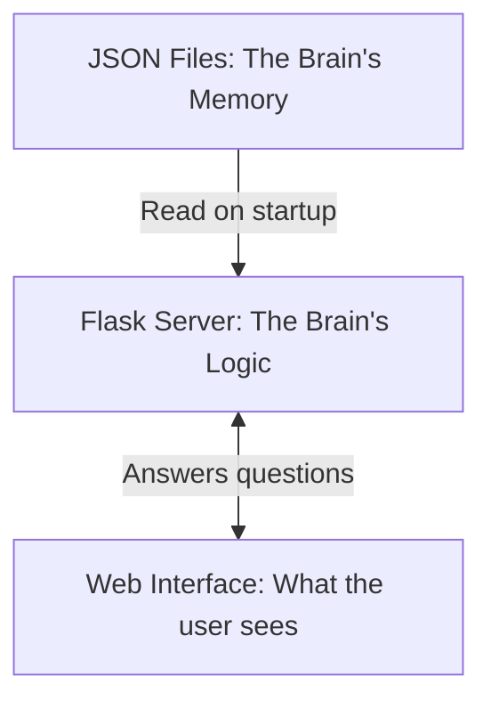
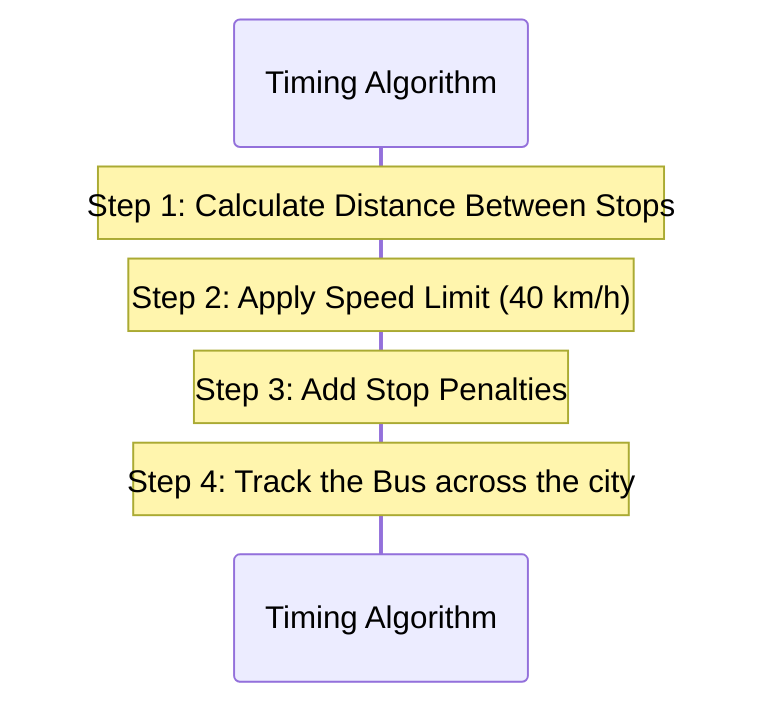

# The CTU Bus Route Visualizer: A Simple Explanation

This document is designed to help you explain this project to a teacher or panel. It breaks down exactly how the app works behind the scenes, from the data storage to the math that predicts bus arrivals.

---

## 1. The Big Picture: How the App is Built

Our app is split into three main pieces: the **Data**, the **Backend**, and the **Frontend**. 



### Why NO Database?
Usually, web apps use a database (like MySQL or MongoDB) to store information. We chose **not** to do that. Instead, all our data is saved in static `.json` files. 
- **Why?** Because JSON files are incredibly fast to load directly into the computer's memory when the server starts. Since bus routes don't change every minute, reading from memory is much faster than constantly querying a database.

---

## 2. The Data Layer
We rely on two main files to make everything work:

1. **`data.json`**: A list of all 888 bus stops in Chandigarh, containing their names and exact GPS coordinates (Latitude and Longitude).
2. **`routes.json`**: A list of 52 routes. It tells us the sequence of stops a bus takes, its daily schedule (e.g., 06:00 to 22:00), how many buses run on it, and the total distance of the route in kilometers.

---

## 3. The Core Logic: "How do you know when the bus arrives?"

This is the most important question your teacher will ask. We don't have live GPS trackers on the buses. Instead, we **mathematically predict** the bus using physics: `Time = Distance ÷ Speed`.

Here is the exact step-by-step logic our Python server uses:



### Step-by-Step Breakdown:
1. **Find Average Distance:** The code takes the total route length (e.g., 30 km) and divides it by the number of stops to find the distance between each stop.
2. **Apply Speed:** We assume the bus travels at a flat average speed of **40 km/h**.
3. **Calculate Time:** We divide the distance by the speed to figure out how many minutes it takes to drive from Stop A to Stop B.
4. **Boarding Penalty:** We add exactly **30 seconds (0.5 minutes)** to every stop to account for passengers getting on and off.
5. **Cumulative Tracking:** We create a running total. If Stop 1 takes 3 mins, Stop 2 takes 3 mins, and Stop 3 takes 3 mins... then the bus reaches Stop 3 exactly 9 minutes after it leaves the first stop.
6. **Find the Departure:** We look at the official CTU timetable to find the next bus leaving the origin point, and just add our running total to find out when it will arrive at the user's specific stop.

**Why is this smart?** Because we track ONE single physical bus from start to finish, the times are guaranteed to always increase (e.g., 18:00 -> 18:04 -> 18:08). Older algorithms calculated each stop independently, which resulted in chaotic, overlapping times.

---

## 4. The Trip Planner: "How do you get from A to B?"

When a user types "I am at Stop A and want to go to Stop Z", here is what the server does:

1. It loops through all 52 routes.
2. It checks: *Does this route contain Stop A?*
3. It checks: *Does this route contain Stop Z?*
4. **Crucial Check:** It checks if Stop A comes *before* Stop Z in the list. (We don't want to suggest a bus traveling in the opposite direction!).
5. If the route is valid, it uses the timing algorithm (explained above) to find out when the next bus will reach Stop A, and how long it will take to drive to Stop Z.
6. It sorts all valid routes so the bus arriving the soonest is shown at the top.

---

## 5. Search & Fuzzy Matching

If a user mispells a stop or route (e.g. typing "route 4c" instead of "4C"), the search still works. 

- We wrote a custom **Fuzzy Matching Algorithm** in Python. 
- If the user types "Route", we intentionally strip that word out so the computer only looks for the number.
- It compares the user's text to the actual text and gives it a "score" from 0.0 to 1.0 based on how similar the words are. If the score is high enough, it shows up in the autocomplete dropdown.

---

## 6. The Frontend Map

We used **Leaflet.js** (an open-source mapping library) instead of Google Maps.
- **Why?** Google Maps requires paid API keys and credit cards. Leaflet is free, open-source, and uses OpenStreetMap data.
- **Design Choice:** We intentionally do *not* draw lines connecting the stops. Lines often look messy and cluttered on a city grid. Instead, we only draw clean, circular markers at the exact GPS coordinates of the stops, allowing the user's brain to easily connect the dots. When using the trip planner, the origin and destination are highlighted in bright orange so they stand out.

---

## 7. The JavaScript Code: Bringing it to Life (`app.js`)

If the Python server is the "brain" doing the math, the JavaScript file is the "puppet master" moving things around on the screen. Here are the core concepts used in our JS file:

### 1. `initMap()` (Setting the Stage)
When you load the page, the very first thing that runs is `initMap()`. This tells Leaflet to create an interactive map on the screen, centered on Chandigarh's coordinates (`[30.7333, 76.7794]`), and applies the OpenStreetMap visual tiles over it.

### 2. `fetch()` (Talking to the Brain)
Throughout the code, you will see `fetch(API + '...')`. This is how Javascript sends a message to our Python server. 
- Example: `fetch('/api/routes')` asks the server "Give me the list of all routes." The server replies with JSON data, which Javascript then loops through to build the right-side route panel.

### 3. `showRouteOnMap()` (Drawing the Stops)
When you click a route, this function runs. It does three things:
1. It deletes any old markers currently on the map.
2. It loops through the new route's stops and creates an `L.circleMarker` at the exact GPS coordinates.
3. It checks if the stop needs to be highlighted (e.g. if it was your origin point).
4. **`map.fitBounds`**: Finally, it mathematically adjusts the map's zoom level so that all the stops fit perfectly on your screen.

### 4. Event Listeners & "Debouncing"
We use `addEventListener` to listen for when the user types or clicks. 
In our Autocomplete search boxes, we use a cool trick called **Debouncing** (`setTimeout` and `clearTimeout`). 
- **The Problem:** If you type "Sector 17", that's 9 letters. Without debouncing, the app would send 9 separate requests to the server in less than a second, crashing it. 
- **The Fix:** Javascript starts a tiny 0.25-second timer when you type. If you press another key before the timer ends, it resets the timer. It only actually sends the request to the server *after* you pause typing for a quarter of a second.

---

## 8. Line-by-Line Code Explanations

If your teacher points to a specific block of code and asks "What does this do?", here is how to explain the most important parts line-by-line.

### A. The Python Timing Engine (`backend/app.py`)
This is the math that figures out how long it takes a bus to get between stops.

```python
# We calculate the average distance between each stop (Total KM / Number of Stops)
avg_dist_km = length_km / (num_stops - 1)

for i in range(num_stops - 1):
    # We assume a flat average driving speed of 40 km/h in city traffic
    eff_speed = 40.0

    # Time = Distance / Speed. We multiply by 60 to convert hours into minutes.
    seg_min = (avg_dist_km / eff_speed) * 60
    
    # We add 0.5 minutes (30 seconds) to account for passengers boarding at the stop
    seg_min += 0.5  

    # A safety check: If two stops are super close, we force it to take at least 1 minute
    if seg_min < 1.0:
        seg_min = 1.0

    # We add this segment's time to our running total for the bus journey
    offsets[i+1] = offsets[i] + seg_min
```

### B. The Trip Planner Search (`backend/app.py`)
How does it know if a route goes from "Stop A" to "Stop B" in the right direction?

```python
# 1. Loop through every stop to find where the user is starting
from_idx = -1
for i, stop in enumerate(stops):
    # If the user's text matches this stop's name, save the index (e.g. Stop #3)
    if from_q in stop['name'].lower().strip():
        from_idx = i
        break

# 2. Find the destination stop, but ONLY look at stops AFTER the starting stop
to_idx = -1
for i, stop in enumerate(stops):
    # If this stop comes before our start point, skip it! (Wrong direction)
    if i <= from_idx:
        continue
        
    # If we find the destination, save the index (e.g. Stop #15)
    if to_q in stop['name'].lower().strip():
        to_idx = i
        break
```

### C. Drawing the Map (`frontend/app.js`)
How do the markers actually appear on the screen?

```javascript
// Loop through every stop on the chosen route
for (var i = 0; i < route.stops.length; i++) {
    var s = route.stops[i];
    var pos = [s.lat, s.lng]; // Grab the GPS coordinates
    
    // Check if this stop was searched for by the user (Origin or Destination)
    var isHighlight = (s.name === highlightFrom || s.name === highlightTo);

    // If highlighted, color it Orange. Otherwise, use the Route's default color.
    var mColor = isHighlight ? '#FF9500' : route.color;
    
    // If highlighted, make the dot bigger (Radius 10). Otherwise normal size (Radius 5).
    var mRadius = isHighlight ? 10 : 5;

    // Tell Leaflet to draw a circle on the map at the GPS coordinates
    var marker = L.circleMarker(pos, {
        radius: mRadius,
        fillColor: mColor,
        fillOpacity: 1,
        color: '#ffffff', // Give the dot a white border
        weight: isHighlight ? 3 : 2 // Make the border thicker if highlighted
    }).addTo(map); // Attach it to the map
}
```

### D. The "Debouncer" (`frontend/app.js`)
How we stop the server from crashing when typing.

```javascript
// Keep track of the timer variable
var timer = null;

// Listen for every time the user presses a key inside the input box
input.addEventListener('input', function() {
    var q = this.value.trim(); // Get what they typed
    
    // IMMEDIATELY cancel the old timer. If they type "A" then "B" quickly, 
    // the timer for "A" is destroyed before it can send a request to the server.
    clearTimeout(timer); 
    
    // Start a new 250 millisecond (0.25 second) countdown
    timer = setTimeout(function() {
        // If 0.25 seconds pass and they haven't typed another key, 
        // finally send the text to the server API to search for stops!
        fetch(API + '/suggest?q=' + encodeURIComponent(q))
            ...
    }, 250);
});
```
